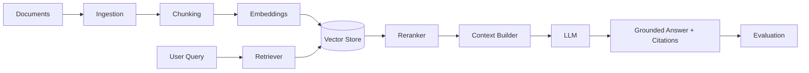

# Enterprise RAG Platform

A production-oriented reference architecture for enterprise knowledge retrieval using RAG.

## Pipeline
`Documents → Parsing → Chunking → Embeddings → Retrieval → Reranking → Context → LLM → Grounded Answer → Evaluation`

## Enterprise Controls
- Source metadata
- Document/version tracking
- Retrieval thresholds
- Citation requirements
- Prompt templates
- Evaluation dataset
- Cost/latency telemetry

## Architecture


## Scope
The included implementation provides a lightweight local retrieval layer so the architecture can be demonstrated without requiring a paid vector database.

## Run
```bash
pip install -r requirements.txt
python examples/demo.py
```
